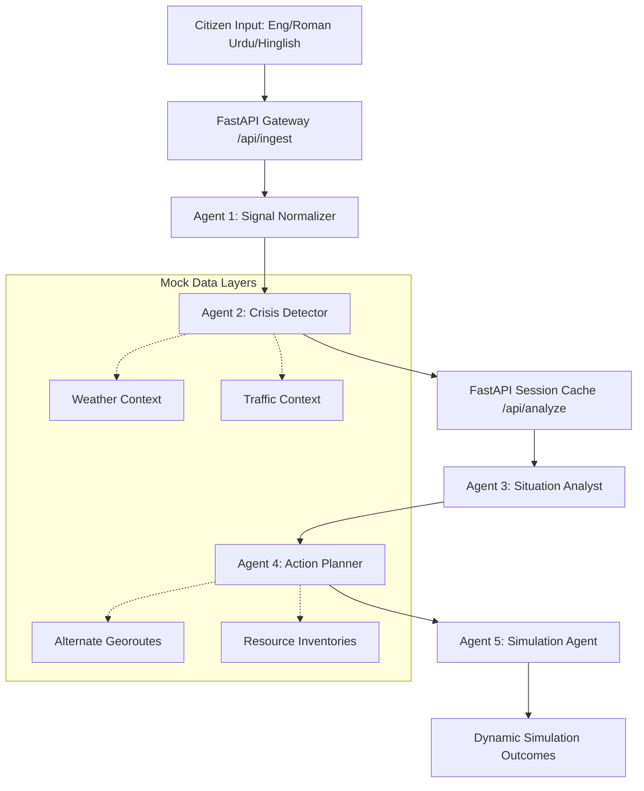

# 🛡️ CIRO (Crisis Intelligence & Response Orchestrator)
## Antigravity AI Orchestration Traces & Development logs
### Hackathon Submission Artifacts (Complete Compilation)

This document contains a comprehensive compilation of all architectural designs, implementation plans, task lists, walkthroughs, and development logs generated by the Antigravity pair-programming agent during the building of **CIRO**.

---

## 🗺️ 1. Global System Architecture



### API Core Contract:
- **`POST /api/ingest`**: Runs early stages (normalization & classification) and caches state.
- **`POST /api/analyze`**: Runs deep situation reporting, action coordination, and simulation forecasting.
- **`GET /api/logs`**: Real-time tracer exposing active agent logs and pipeline telemetry.
- **`GET /api/demo`**: Executes the G-10 Islamabad Flash Flood sequence.

---

## 🤖 2. 5-Agent Pipeline & Persona Specs

### 📡 Agent 1: SignalNormalizerAgent
- **Purpose**: Parse raw, noisy multilingual inputs (Roman Urdu / Hinglish) and structure into normalized tokens.
- **Lexicon Translation Map**:
  - *"pani bhar gaya"* ➔ waterlogged / flooded
  - *"gaariyan phans gayi"* ➔ vehicles trapped
  - *"raasta band"* ➔ road blocked
  - *"bijli gul"* ➔ power grid outage
  - *"haadsa"* ➔ accident

### 🔍 Agent 2: CrisisDetectorAgent
- **Purpose**: Multi-source data fusion. Merges normalizer outputs with real-time weather and traffic mock layers to output crisis severity type with variable confidence scores:
  - *Social signal alone* ➔ Max confidence `0.70`
  - *Social + Weather match* ➔ Max confidence `0.85`
  - *Social + Weather + Traffic match* ➔ Max confidence `0.97`

### 📊 Agent 3: SituationAnalystAgent
- **Purpose**: Quantitative risk assessment. Computes severity scoring matrix:
  - `Low (1-3)`: <100 citizens affected, no immediate threat.
  - `Medium (4-6)`: 100-1000 affected, localized blockages.
  - `High (7-8)`: 1000-10,000 affected, potential casualty risks.
  - `Critical (9-10)`: >10,000 affected, high casualty threats, infrastructure failure.

### 📋 Agent 4: ActionPlannerAgent
- **Purpose**: Orchestrate synchronized response protocols:
  - *Traffic Rerouting*: Diversion paths, blockade updates.
  - *Emergency Dispatch*: Service tasking (Rescue 1122, NDMA, CDA).
  - *Public Alerts*: Broadcast messages (SMS / Push) in English and Urdu.
  - *Resource Allocation*: Water pumps, emergency power units, ambulance distributions.

### ⚙️ Agent 5: SimulationAgent
- **Purpose**: Execute predictive simulation to output before-and-after states:
  - *Emergency Tickets*: Simulated field tickets with IDs (`TKT-YYYYMMDD-XXXXXX`).
  - *Route Actions*: Diversion details (`RU-XXXX`).
  - *Mitigation Impact*: Estimated lives protected (safeguarded against extreme bounds), property saved.

---

## 🛠️ 3. Feature Iteration & Bug-Fix Trace Logs

### 🔄 Trace 1: LLM Engine Migration to Google Vertex AI Gemini
* **Status**: **Success**
* **Target File**: [base_agent.py](file:///d:/CIRO/app/agents/base_agent.py)
* **Goal**: Switch LLM queries from Groq to Google Vertex AI Gemini (`gemini-2.0-flash`) as the primary execution engine.
* **Resolution Plan**:
  - Integrated `google-genai` SDK.
  - Modified `_call_llm()` to attempt `_call_gemini()` first.
  - Added robust fallback to Groq (`_call_groq()`) in case of quota breaches.
  - Added list-based API key rotation to prevent `429 Too Many Requests` limits:
    ```python
    GEMINI_KEYS = list(filter(None, [
        os.environ.get("GEMINI_API_KEY_1"),
        os.environ.get("GEMINI_API_KEY_2"),
        os.environ.get("GEMINI_API_KEY"),
    ]))
    ```

### 📲 Trace 2: Mobile Timeout Alignment & Transition States
* **Status**: **Success**
* **Target File**: React Native Client
* **Goal**: Fix app connectivity issues by adjusting API timeouts and building intermediate loader updates.
* **Resolution Plan**:
  - Increased network request timeouts to `120,000ms` (120 seconds).
  - Implemented progressive trace updates on loaders:
    - `0s - 5s`: *"Analyzing crisis signals..."*
    - `5s - 15s`: *"Running AI agents..."*
    - `15s - 30s`: *"Generating response plan..."*
    - `30s+`: *"Finalizing simulation..."*

### 🎟️ Trace 3: Simulation Metrics Normalization
* **Status**: **Success**
* **Target File**: [simulation_agent.py](file:///d:/CIRO/app/agents/simulation_agent.py)
* **Goal**: Standardize estimated lives metrics to prevent bloated values (e.g. over 1,000,000 for local heatwaves) and format readouts natively.
* **Resolution Plan**:
  - Standardized generator caps for estimated lives between `50` and `2,500` depending on severity.
  - Implemented formatter:
    - `val >= 1,000,000` ➔ `1M`
    - `val >= 1,000` ➔ `50K`
    - `otherwise` ➔ raw integer format.

### 📊 Trace 4: Operation Center Dashboard
* **Status**: **Success**
* **Target File**: [index.html](file:///d:/CIRO/web/index.html)
* **Goal**: Redesign the hardcoded dashboard with military Emergency Operations Center (EOC) aesthetics.
* **Resolution Plan**:
  - Styled dark visual scheme (`#0a0a0f`) with amber highlight structures.
  - Implemented Leaflet.js rendering **CartoDB Dark Matter** dark tiles dynamically centered on Islamabad (`33.6844, 73.0479`) or Lahore (`31.5204, 74.3587`) coordinates.
  - Added a glowing red coordinate hotspot marker.
  - Integrated 10s background log polling.
  - Fixed agent traces text clipping with `-webkit-line-clamp: 3` and click-to-expand card logic.

---

## 📋 4. Final Verification Checklist

- [x] All 5 specialized agents structured and integrated with FastAPI.
- [x] Primary LLM calls executing Gemini-2.0-Flash successfully.
- [x] API Key Rotation with fallback to Groq functional.
- [x] Mobile timeout increased to 120s with step-by-step loaders.
- [x] Web dashboard fully responsive with dynamic leaflet mapping and glowing EOC features.
- [x] Commits pushed to Git repository `main` branch.
